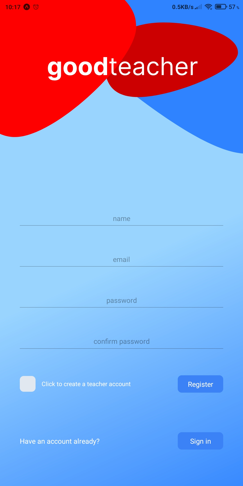
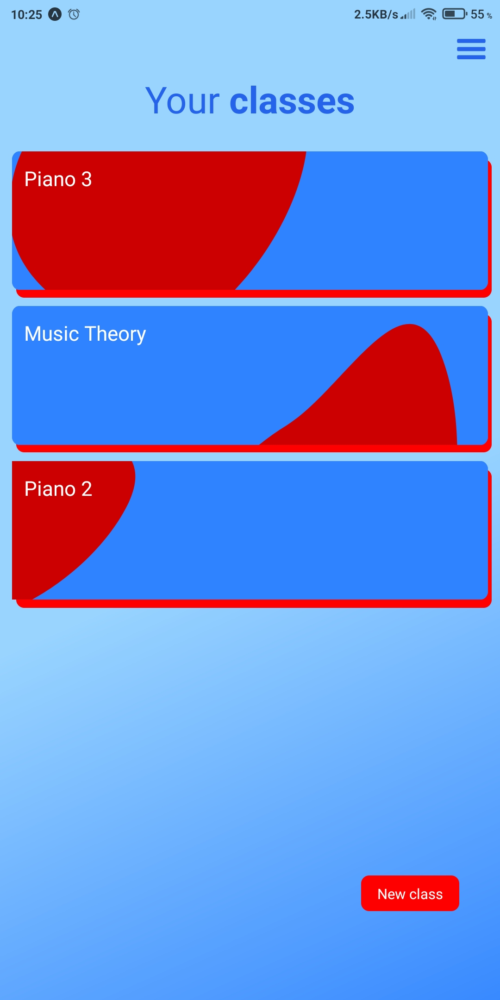
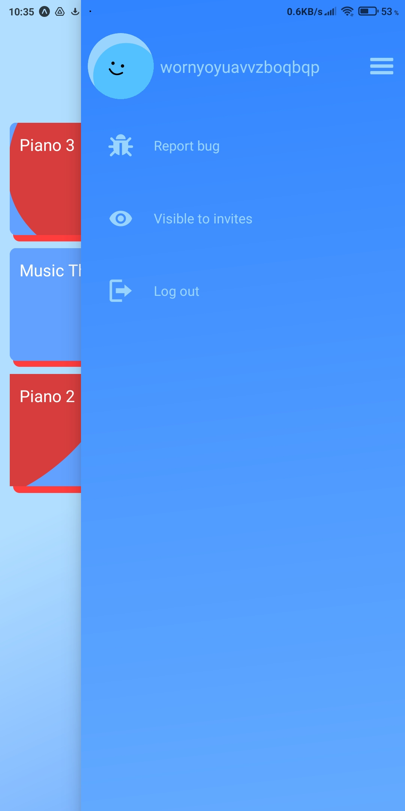
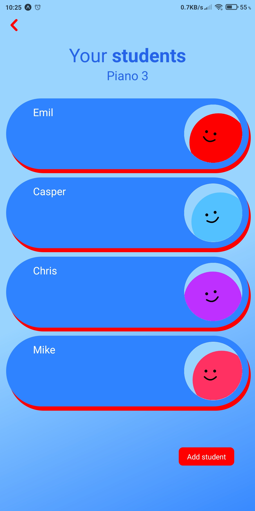
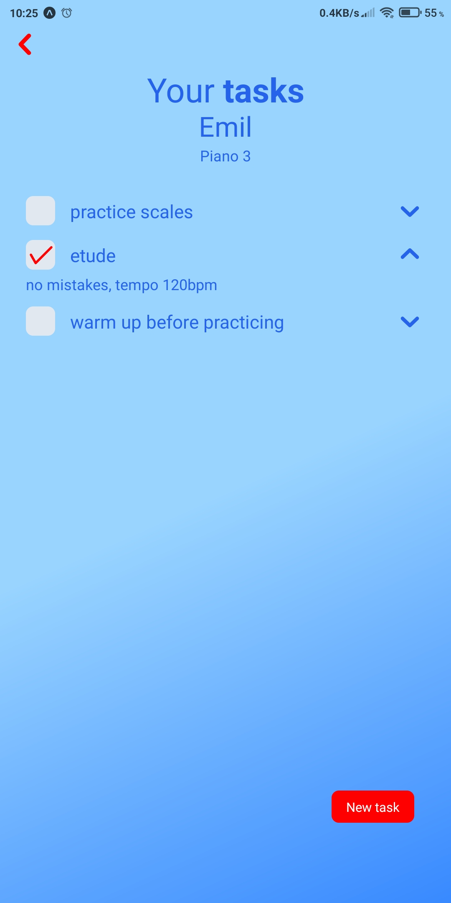

  
  
:warning: This is a repository for the frontend side of this project - you can find server side in <a>goodteacher-api</a> repository.

>## Description
Goodteacher is an online replacement of a student notebook. It's made for teachers and students, primarily with music schools in mind, but it can be used in any field. Teachers can create classes, add students to them and send out tasks for students. The students can join classes and manage their task - complete or add more of them. It is a mobile application written in React Native with a Node.js server and a database. It features dynamically generated SVG avatars.
>## Preview

	
View screenshots

  
  
  
  
  

>## Tech stack
<ul>
  
server:

    <ul>
      <li>Node.js</li>
      <li>Express.js</li>
    </ul>
  
client:

    <ul>
      <li>React Native</li>
      <li>Expo</li>
    </ul>
  
database:

    <ul>
      <li>PostgreSQL</li>
      <li>Redis</li>
      <li>Prisma</li>
    </ul>
  
authorization:

    <ul>
      <li>Json Web Token</li>
    </ul>
  
testing:

    <ul>
      <li>Jest</li>
    </ul>
  
other:

    <ul>
      <li>Tailwind</li>
      <li>Axios</li>
      <li>Zod</li>
      <li>i18next</li>
    </ul>
</ul>

>## Prerequisites
>## Installation
>## Upcoming features
<ul>
  <li>report a bug</li>
  <li>push notifications</li>
  <li>file upload</li>
  <li>browser-based class register</li>
  <li>project website</li>
  <li>ap published to playstore</li>
</ul>